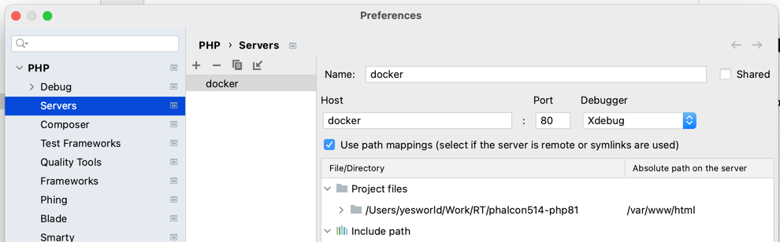
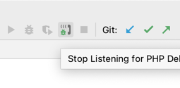

# Install Xdebug 3

1. Install extension for chrome [xdebug-helper](https://chrome.google.com/webstore/detail/xdebug-helper/eadndfjplgieldjbigjakmdgkmoaaaoc)
2. Add to Settings > PHP > Servers.
- the Server name must be the same as in the `docker-compose.yml` file. Default: **docker**
  
   

- and set path to section "Use path mappings"

3. Start listener
   
   

